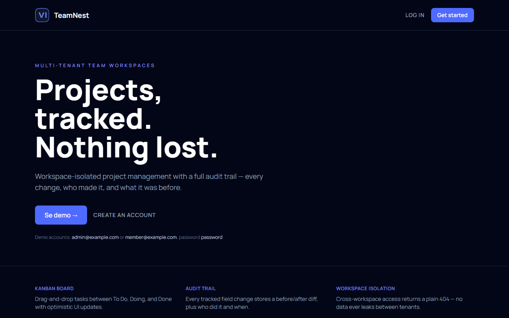
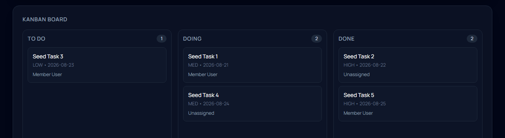
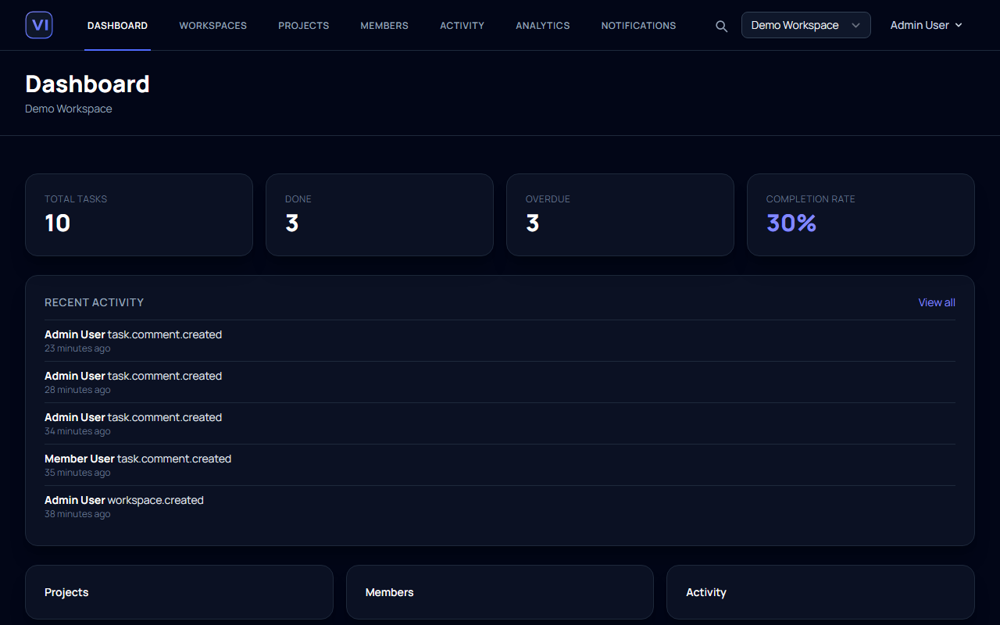
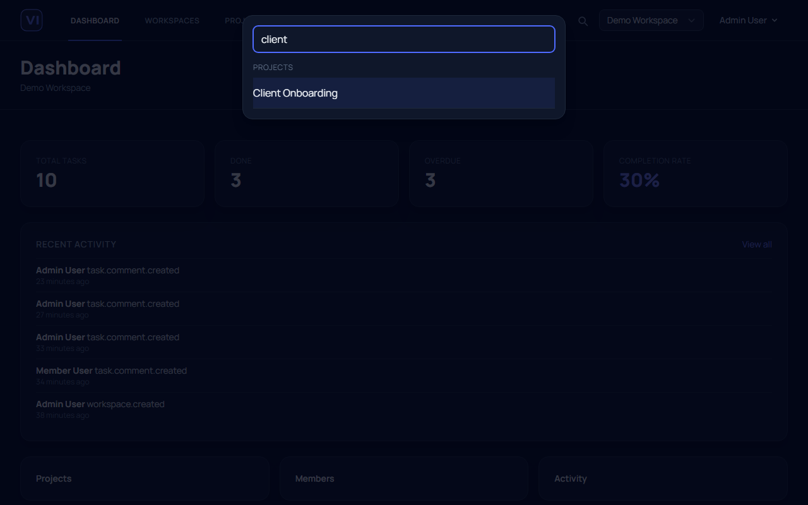
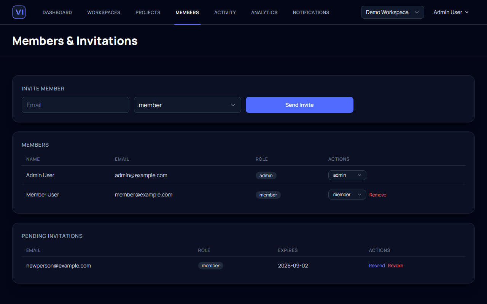
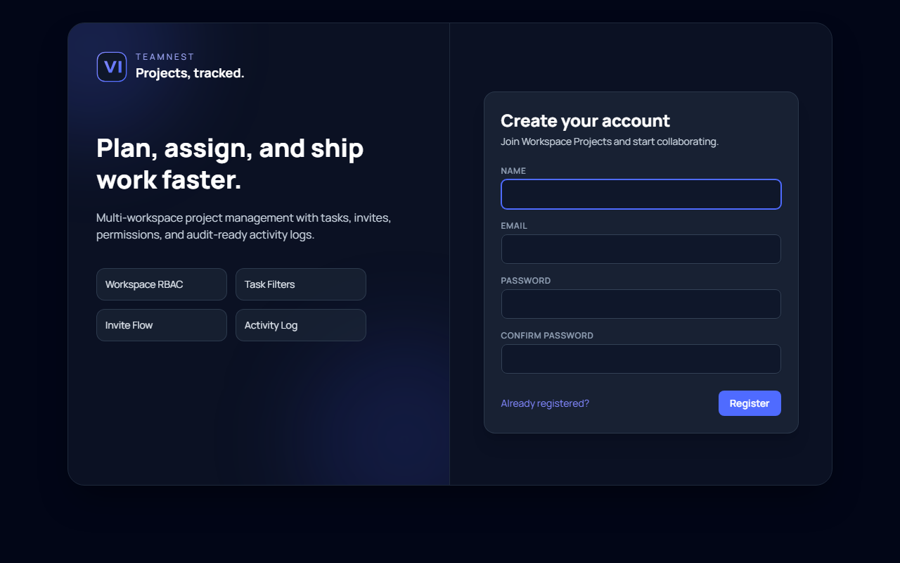

# TeamNest

TeamNest is a portfolio-grade Laravel mini-SaaS for managing projects and tasks inside isolated team workspaces — multi-tenant RBAC, a real-time Kanban board, global search, and a full before/after audit trail on every tracked change.

Not deployed yet — run it locally with [Setup](#setup) below, then log in with the [demo accounts](#demo-accounts).

## Screenshots

| Landing page | Kanban board |
|---|---|
|  |  |

| Dashboard | Global search (Cmd/Ctrl+K) |
|---|---|
|  |  |

| Members & invitations |
|---|
|  |

<details>
<summary>Sign-up screen</summary>



</details>

## Features

- Laravel 12 + Breeze (Blade + Tailwind) authentication
- Workspace-scoped multi-tenancy with session-based current workspace
- Workspace RBAC (`admin`, `member`)
- Guided first-run onboarding with real empty states (no workspace yet, no projects yet, no activity yet)
- Global search (Cmd/Ctrl+K) across projects, tasks, and members, scoped to the current workspace
- Invitation flow with expiring token links and secure token hashing
- Queued invitation and reminder emails (database queue)
- Activity log with actor, subject, action, metadata JSON
- Task audit trail storing `before` / `after` diffs for changed tracked fields
- Project and task soft delete + restore + force delete trash views
- Task filtering by status/assignee/overdue/priority and search by title/description
- Real-time Kanban board (Pusher-backed): drag-and-drop moves broadcast live to every other viewer, plus a "who's viewing now" presence indicator
- Live task comments — a comment posted by a teammate appears on an open task page with no refresh
- Task comments with `@email` mentions + file attachments
- In-app notifications inbox with unread state, with the nav badge updating live on new mentions
- Daily due-date reminder pipeline (queued email + in-app notification)
- Saved task filter views and bulk task actions
- Workspace settings (branding/role/timezone/retention)
- Workspace analytics dashboard (completion, overdue, workload)
- API + personal access tokens (Sanctum)
- Demo seed data and comprehensive feature tests

## Requirements

- PHP 8.2+
- Composer
- Node.js + npm (for frontend assets)
- SQLite (default) or MySQL/PostgreSQL via `.env`

## Setup

```bash
composer install
cp .env.example .env
php artisan key:generate
php artisan migrate --seed
npm install
npm run build
php artisan storage:link
php artisan serve
```

## Real-Time Updates

Live Kanban moves, live comments, and the live notification badge run over [Pusher Channels](https://pusher.com/channels) (a hosted WebSocket service, not a self-hosted server). Without credentials configured, the app runs normally — real-time features just silently stay off.

To enable them, create a free Pusher Channels app and add its credentials to `.env`:

```env
BROADCAST_CONNECTION=pusher
PUSHER_APP_ID=
PUSHER_APP_KEY=
PUSHER_APP_SECRET=
PUSHER_APP_CLUSTER=
VITE_PUSHER_APP_KEY="${PUSHER_APP_KEY}"
VITE_PUSHER_APP_CLUSTER="${PUSHER_APP_CLUSTER}"
```

Broadcast events are queued, so a running queue worker is required for real-time updates to actually deliver (see below) — `npm run build` (or `npm run dev`) must also be re-run after changing the `VITE_PUSHER_*` values, since they're compiled into the frontend bundle.

## Queue + Scheduler

Default queue driver is `database`. A running worker is required both for the daily reminder jobs below and for real-time broadcast events (Kanban moves, comments, notifications) to actually deliver.

```bash
php artisan queue:work
```

Invitation reminders are scheduled daily through:

- Command: `php artisan workspace:send-invitation-reminders`
- Scheduler: configured in `routes/console.php`

Task due reminders:

- Command: `php artisan workspace:send-task-reminders`
- Scheduler: daily at `08:00` in `routes/console.php`

Run scheduler locally:

```bash
php artisan schedule:work
```

## Demo Accounts

- `admin@example.com` / `password`
- `member@example.com` / `password`

## Running Tests

```bash
php artisan test
```

## Quality Checks

```bash
./vendor/bin/pint --test
./vendor/bin/phpstan analyse
```

## API Usage

Create a token from `API Tokens` page in-app (`/api-tokens`) or via `POST /api/tokens`.

Use:

- Header: `Authorization: Bearer {token}`
- Header: `X-Workspace-Id: {workspace_id}` (required when user belongs to multiple workspaces)

Endpoints:

- `GET /api/projects`
- `GET /api/projects/{project}/tasks`
- `GET /api/tokens`
- `POST /api/tokens`
- `DELETE /api/tokens/{tokenId}`

## CI

GitHub Actions pipeline (`.github/workflows/ci.yml`) runs:

- PHP syntax checks (`php -l`)
- Laravel Pint
- PHPStan/Larastan
- PHPUnit feature tests

## Key Design Choices

- Cross-workspace resource access returns `404` to prevent data leakage.
- Workspace data is always resolved against the current session workspace.
- Invitation tokens are never stored in plain text; only SHA-256 hashes are stored.
- Admin safeguards prevent removing/demoting the last admin or workspace owner.
